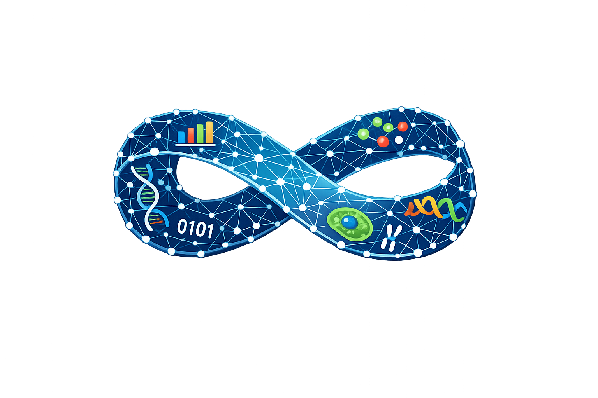

<h1>
  
  MOBIUS
</h1>

**MOBIUS – Multi-Omics Biomarker Integration User-friendly Suite**

MOBIUS is a modular, browser-based framework for the analysis and integration of heterogeneous multi-omics tabular data, with a particular focus on **biomarker discovery**, **feature selection**, **machine learning**, and **network-based analysis**.

Rather than enforcing a predefined end-to-end analytical pipeline, MOBIUS provides interoperable components that can be flexibly combined to build and compare customized multi-omics workflows.

It supports **early, late, and hybrid integration strategies**, enabling researchers to systematically investigate how alternative data-integration and feature-selection approaches affect predictive performance, signature complexity, and biological interpretability.

---

## Key Features

MOBIUS provides an integrated environment for:

- Multi-omics data preparation and harmonization
- Exploratory Data Analysis (EDA)
- Correlation network construction
- Complex network analysis and visualization
- Network pruning and network comparison
- Community detection
- Traditional feature selection
- Ensemble feature selection
- Network-aware feature selection
- Machine-learning model training and evaluation
- Early, late, and hybrid multi-omics integration
- Cross-validation and independent test-set evaluation
- Interactive visualization of results
- Reproducible analysis through Docker containerization

---

## MOBIUS Architecture

MOBIUS is organized into three main modules:

### 1. Data Preparation

The Data Preparation module handles the import, harmonization, and preprocessing of metadata and omics datasets.

It supports:

- metadata and omics table import;
- sample matching across multiple omics layers;
- configurable data transformations;
- supervised task definition;
- training/test splitting;
- correlation network construction;
- optional external validation datasets.

Correlation networks represent omics features as nodes and their statistical relationships as weighted edges.

---

### 2. Complex Network Analysis

The Complex Network module provides tools for exploring and manipulating correlation networks.

Available operations include:

- network loading and subnetwork extraction;
- threshold-based edge pruning;
- centrality analysis;
- community detection;
- interactive network visualization;
- comparison of networks across experimental conditions;
- identification of common and condition-specific relationships.

Networks can therefore be analyzed, pruned, and compared to refine their topology, reduce redundant signals, and identify biologically interpretable feature communities.

---

### 3. Machine Learning Analysis

The Machine Learning module provides multiple strategies for biomarker identification and predictive-model evaluation.

MOBIUS includes:

#### Exploratory Data Analysis

- PCA
- Kernel PCA
- t-SNE
- feature distribution visualization
- statistical testing

#### Traditional Feature Selection

Filter, embedded, and wrapper approaches implemented using standard machine-learning libraries.

#### Ensemble Feature Selection

Multiple feature selectors are combined across bootstrap replicas to identify robust and recurrent features.

#### Network-based Feature Selection

MOBIUS implements a network-aware **minimum Redundancy Maximum Relevance (mRMR)** strategy formulated as a multi-objective optimization problem.

Feature relevance and redundancy are optimized simultaneously using the **NSGA-II evolutionary algorithm**.

Feature relevance can be estimated using:

- univariate importance scores;
- model-driven SHAP importance scores.

Network communities are exploited to account for redundancy among correlated molecular features.

#### Model Evaluation

Feature signatures can be evaluated using multiple classification algorithms, including:

- Logistic Regression
- Support Vector Machines
- k-Nearest Neighbors
- Naive Bayes
- Random Forest
- Gradient Boosting

Evaluation can be performed using configurable cross-validation strategies, including **k-fold CV** and **leave-one-out cross-validation (LOOCV)**, as well as independent external test datasets.

---

## Multi-Omics Integration

MOBIUS enables the construction and comparison of different multi-omics integration paradigms.

### Early Integration

Omics layers are combined before feature selection and model training.

```text
Omics 1 ─┐
Omics 2 ─┼─> Joint Feature Selection ─> Model
Omics 3 ─┘
```

### Late Integration

Feature selection and/or predictive modeling are performed independently for each omics layer before combining the resulting signatures or predictions.

```text
Omics 1 ─> Feature Selection ─┐
Omics 2 ─> Feature Selection ─┼─> Integration ─> Model
Omics 3 ─> Feature Selection ─┘
```

### Hybrid Integration

MOBIUS components can be combined to construct customized strategies mixing early- and late-integration steps.

This modular design allows systematic and reproducible comparison of alternative multi-omics workflows.

---

## Information Leakage Prevention

For supervised analyses, MOBIUS constructs networks, estimates feature relevance, performs feature selection, and trains predictive models using **training data only**.

Independent test datasets are reserved for final model assessment.

This design reduces the risk of information leakage during feature selection and model evaluation.

---

# Installation

The recommended way to run MOBIUS is through **Docker Compose**.

## Requirements

You need:

- [Docker](https://www.docker.com/)
- Docker Compose

No manual installation of Python packages or system dependencies is required when using the provided Docker image.

---

## Quick Start with Docker Compose

Create a file named:

```text
docker-compose.yml
```

with the following content:

```yaml
services:

  mongo:
    image: mongo:7.0
    container_name: mongo_db
    restart: unless-stopped

    ports:
      - "27018:27017"

    volumes:
      - mongo_data:/data/db

    networks:
      - mobius_network


  mobius:
    image: cursecatcher/mobius:mongo
    pull_policy: always
    container_name: mobius
    restart: unless-stopped

    ports:
      - "8501:8501"

    environment:
      - MONGO_URI=mongodb://mongo:27017

    depends_on:
      - mongo

    networks:
      - mobius_network


networks:
  mobius_network:


volumes:
  mongo_data:
```

Start MOBIUS with:

```bash
docker compose up
```

or run it in the background with:

```bash
docker compose up -d
```

Then open:

```text
http://localhost:8501
```

in your web browser.

---

## Stop MOBIUS

To stop the containers:

```bash
docker compose down
```

Persistent MongoDB data are retained in the Docker volume.

To also remove stored data:

```bash
docker compose down -v
```

> **Warning:** the `-v` option permanently removes the MongoDB volume and all data stored by MOBIUS.

---

# Build from Source

Clone the repository:

```bash
git clone https://github.com/qBioTurin/mobius.git
cd mobius
```

Build the MOBIUS Docker image:

```bash
docker build -t mobius .
```

The recommended production deployment uses Docker Compose because MOBIUS relies on MongoDB for persistence and GridFS-based storage.

---

# Technology Stack

MOBIUS is primarily developed in **Python 3** and uses:

- [Streamlit](https://streamlit.io/) — browser-based graphical interface
- [NumPy](https://numpy.org/)
- [pandas](https://pandas.pydata.org/)
- [scikit-learn](https://scikit-learn.org/)
- [graph-tool](https://graph-tool.skewed.de/)
- [pymoo](https://pymoo.org/) — multi-objective optimization
- [Plotly](https://plotly.com/python/) — interactive visualization
- [SHAP](https://shap.readthedocs.io/) — model interpretation
- [MongoDB](https://www.mongodb.com/) — data persistence and caching
- MongoDB GridFS — storage of large datasets
- Docker / Docker Compose — reproducible deployment

---

# Typical Workflow

A typical MOBIUS analysis consists of:

```text
Multi-Omics Data
       │
       ▼
Data Preparation
       │
       ├── Data harmonization
       ├── Transformations
       ├── Train/Test definition
       └── Network construction
       │
       ▼
Exploratory Analysis
       │
       ▼
Complex Network Analysis
       │
       ├── Network analysis
       ├── Community detection
       ├── Network pruning
       └── Network comparison
       │
       ▼
Feature Selection
       │
       ├── Traditional
       ├── Ensemble
       └── Network-based mRMR / NSGA-II
       │
       ▼
Model Evaluation
       │
       ├── Cross-validation
       ├── Independent validation
       └── Performance comparison
       │
       ▼
Multi-Omics Biomarker Signature
```

Because individual components are interoperable, users are not restricted to this sequence and can construct alternative workflows according to the biological question under investigation.

---

# Applications

MOBIUS has been evaluated on real multi-omics datasets addressing different classification problems.

The framework enables researchers to compare alternative integration strategies and identify **compact, predictive, and biologically interpretable multi-omic signatures**.

In particular, MOBIUS facilitates the investigation of trade-offs among:

- predictive performance;
- number of selected biomarkers;
- redundancy among selected features;
- robustness of the signature;
- biological interpretability.

---

# Reproducibility

Reproducibility is a core design principle of MOBIUS.

The combination of:

- modular analytical components;
- explicit workflow construction;
- parameter tracking;
- persistent result storage;
- Docker containerization;

makes it possible to reproduce and compare alternative multi-omics analyses within a controlled computational environment.

---

# Citation

If you use MOBIUS in your research, please cite:

> Licheri N., Sirovich R., Ferrero G., Pardini B., Naccarati A., Aucello R., Beccuti M., Cordero F.  
> **MOBIUS: a Multi-Omics Biomarker Integration User-friendly Suite via machine learning and network representations.**

Citation information will be updated upon publication.

---

# Authors

MOBIUS was developed by researchers from:

- **Department of Computer Science, University of Turin, Italy**
- **Italian Institute for Genomic Medicine (IIGM), c/o IRCCS Candiolo, Turin, Italy**
- **Department of Clinical and Biological Sciences, University of Turin, Italy**
- **Department of Mathematics “Giuseppe Peano”, University of Turin, Italy**

Authors:

- Nicola Licheri
- Roberta Sirovich
- Giulio Ferrero
- Barbara Pardini
- Alessio Naccarati
- Riccardo Aucello
- Francesca Cordero
- Marco Beccuti


---

# License

Please refer to the [`LICENSE`](LICENSE) file for information about the terms of use and redistribution of MOBIUS.

---

# Repository

Source code:

**https://github.com/qBioTurin/mobius**

Docker image:

**https://hub.docker.com/r/cursecatcher/mobius**

---

## Contact

For questions, bug reports, or feature requests, please use the GitHub issue tracker:

**https://github.com/qBioTurin/mobius/issues**
